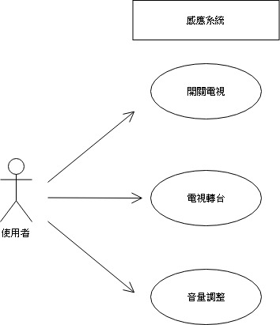
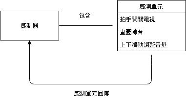
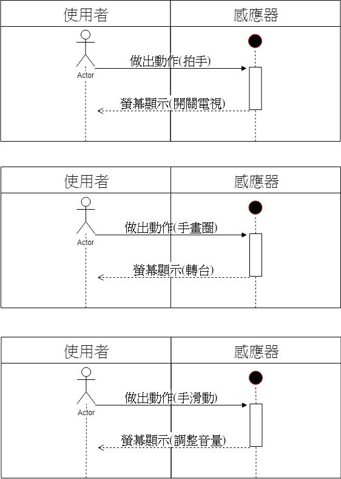
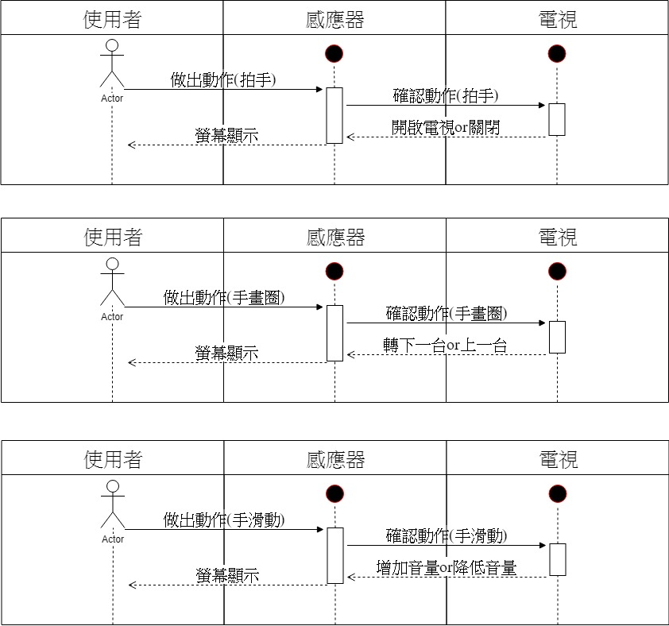
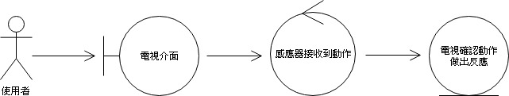

### 1.	專題題目
SMART TV
### 2.	文字敘述專題需求
感測人在電視前的動作，並使電視做出相對回應。
### 3.	寫出專題之功能性需求與非功能性需求
#### 功能性需求： 
>輸入1：感應到人的動作-拍手一下 

>輸出1：打開電視 

>輸入2：感應到人的動作-拍手二下 

>輸出2：關閉電視 

>輸入3：感應到人的動作-手往右畫圈 

>輸出3：轉下一台 

>輸入4：感應到人的動作-手往左畫圈 

>輸出4：轉前一台 

>輸入5：感應到人的動作-手往上滑 

>輸出5：增加音量 

>輸入6：感應到人的動作-手往下滑 

>輸出6：降低音量 

>其他：演算法、使用者介面 

#### 非功能性需求： 

>操作性：系統可以感知到電視前的所有人 

>效能：用戶與系統互動無法連續1秒以及同時間超過一人

>安全：只有電視前方的人才能使用

### 4.	畫出 使用案例圖 (use case diagram)

### 5.	由上而下 排出 使用案例的重要性
開關電視

轉台

調整音量

### 6. 寫出 其中的 至少三個使用案例
#### 開電視

|    主要路徑  |    替代路徑        |
|:------------|:------------      |                 
|1.Seal要開電視|1.1 Seal拿遙控開電視|
|2.Seal拍手    |                   |
|3.偵測器「聽到」|                 |
|4.電視感測動作，開電視|             |

#### 轉台

|    主要路徑  |    替代路徑        |
|:------------|:------------      |
|1.Seal要轉台|                   |
|2.Seal往左或右畫圈|2.1 Seal拿遙控轉台|
|3.偵測器「看到」|                 |
|4.電視感測動作，換台|             |

#### 調整音量

|    主要路徑  |    替代路徑        |
|:------------|:------------      |
|1.Seal要調電視音量|                   |
|2.Seal手往上或下滑動|2.1 Seal拿遙控調音量|
|3.偵測器「看到」|                 |
|4.電視感測動作，調音量|             |

#### 關電視

|    主要路徑  |    替代路徑        |
|:------------|:------------      |             
|1.Seal要關電視|1.1 Seal拿遙控關電視|
|2.Seal拍兩下手    |                   |
|3.偵測器「聽到」|                 |
|4.電視感測動作，關電視|             |

### 7. 寫出 user story 

身為一個使用者，當手髒時還能方便將電視轉台，而且也不再為找電視遙控器而煩惱。

### 8.初步類別表
#### 開電視  轉台  調音量

### 9.系統循序圖

### 10.循序圖

### 11.強韌圖

